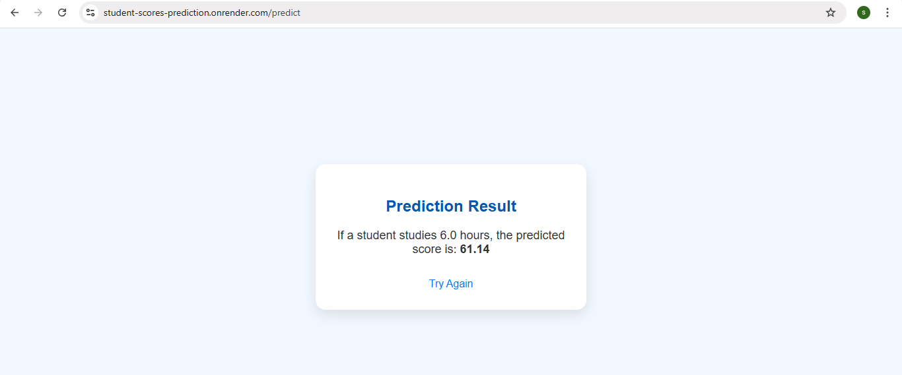

# Student-Scores-prediction

This is a web application that predicts student exam scores based on the number of study hours using a **Linear Regression model.** The app is built with Flask, trained on a real dataset, and deployed on Render for live access.

---

## Features

- Predicts Student Scores based on input study hours using a trained Linear Regression model.
- Web-based Interface built with Flask for easy interaction and input.
- Model Trained on Real Dataset (Student Hours vs Scores).
- Deployed Live on Render for online access anytime.
- Clean UI with CSS Styling for a user-friendly experience.


---

## Prerequisites

Make sure the following are installed:

- Python 3.7 or higher installed
- Git installed and configured
- Basic knowledge of Python and Flask
- A GitHub account (for code hosting)
- Render account (for deployment)

---

## Installation

### 1. Clone the repository

```
git clone https://github.com/sandhiya0147/Student-Scores-prediction.git
cd Student-Scores-prediction
```

### 2. Install dependencies

```
pip install -r requirements.txt
```

---

## Running the Application

Start the Flask development server:

```
python app.py
```

Then open your browser and go to:

```
http://127.0.0.1:5000
```

---

## How It Works

-  The user enters the number of study hours on the web page.
-  The Flask app sends this input to a trained Linear Regression model.
-  The model calculates and predicts the expected exam score.
-  The prediction is returned and displayed on a result page.
-  The entire app runs live on Render, accessible from any browser.

---

## File Structure

```
Student-Score-Prediction/
├── app.py
├── model_train.py
├── model.pkl
├── score_data.csv
├── requirements.txt
├── Procfile
├── README.md
├── static/
│   └── style.css
├── templates/
│   ├── home.html
│   └── result.html
└── assets/
    └── example.png       
```

---

## Future Improvements

- Add charts to visualize the relationship between study hours and scores.
- Include more input features like sleep hours or previous grades for better predictions.
- Allow file uploads for batch predictions using CSV or Excel.
- Improve the frontend using responsive frameworks like Bootstrap.
- Provide an API endpoint to support integration with other applications.

---


## Step-by-Step Guide: How to Use the Movie Interest Predictor


### Step 1: Input Form
  

### Step 2: Filled Form 
  

### Step 3: Prediction Result


---

## Live Demo

[Click here to view the deployed app](https://student-scores-prediction.onrender.com)

---
